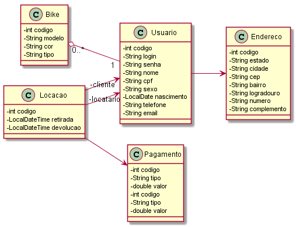

# VaidBike
O projeto de Aplicação escolhido tem como objetivo intermediar a interação
entre os usuários facilitando o aluguel de bicicletas entre locador e
locatário.

## Motivação
A ociosidade pode ser um prejuízo em muitos aspectos, e se você pudesse pegar
aquela bike que você não usa mais e ganhar uma grana extra?
Talvez você queria começar a pedalar, mas não quer gastar uma "fortuna" com
uma Bike e acessórios para só depois descobrir se vai se identificar com o
ciclismo.

## Soluções existentes
Bike Itau, Bike santos, ambos utilizam plataformas que possuem suas próprias
bicicletas, esses serviços estão disponíveis apenas em capitais.

## Inovação
O grande diferencial do VaidBike é que você ou qualquer pessoa pode ganhar
uma grana extra alugando a sua bike que fica geralmente jogada na garagem, ou
se você pretende sair do sedentarismo e não sabe por onde começar, aqui está
uma ótima possibilidade de melhorar sua qualidade de vida alugando a bike de
seu vizinho.

## Público alvo
Qualquer pessoa que deseja mudar a rotina ou começar a praticar ciclismo,
melhorar a qualidade de vida, ou simplesmente evitar o trânsito.

## Monetização
A monetização virá através de "comissões" pelos aluguéis das bicicletas, e
pela intermediação do serviço.

## Diagrama de Classes

## Ferramental utilizado
- NetBeans
- Android Studio
- PostgreSQL
- Maven
- JSF
- Hibernate
- Gradle
- Java
- CSS
- HTML

## Contribuidores
- [@vsnepomuceno](https://github.com/vsnepomuceno) como Vilmar Nepomuceno
- [@milenamaced](https://github.com/milenamaced) como Milena Macedo
- [@Lucianocljr](https://github.com/Lucianocljr)  como Luciano Júnior
- [@CarlosAndreCordeiro](https://github.com/CarlosAndreCordeiro) como Carlos
 Cordeiro
- [@adriellycl](https://github.com/adriellycl) como Adrielly Sales

## Licença
MIT License

Copyright (c) 2018 Milena dos Santos Macedo, Carlos André Cordeiro da Silva,
Adrielly Calado Sales, Luciano Campos de Lima Júnior.

Permission is hereby granted, free of charge, to any person obtaining a copy
of this software and associated documentation files (the "Software"), to deal
in the Software without restriction, including without limitation the rights
to use, copy, modify, merge, publish, distribute, sublicense, and/or sell
copies of the Software, and to permit persons to whom the Software is
furnished to do so, subject to the following conditions:

The above copyright notice and this permission notice shall be included in
all copies or substantial portions of the Software.

THE SOFTWARE IS PROVIDED "AS IS", WITHOUT WARRANTY OF ANY KIND, EXPRESS OR
IMPLIED, INCLUDING BUT NOT LIMITED TO THE WARRANTIES OF MERCHANTABILITY,
FITNESS FOR A PARTICULAR PURPOSE AND NONINFRINGEMENT. IN NO EVENT SHALL THE
AUTHORS OR COPYRIGHT HOLDERS BE LIABLE FOR ANY CLAIM, DAMAGES OR OTHER
LIABILITY, WHETHER IN AN ACTION OF CONTRACT, TORT OR OTHERWISE, ARISING FROM,
OUT OF OR IN CONNECTION WITH THE SOFTWARE OR THE USE OR OTHER DEALINGS IN THE
SOFTWARE.
